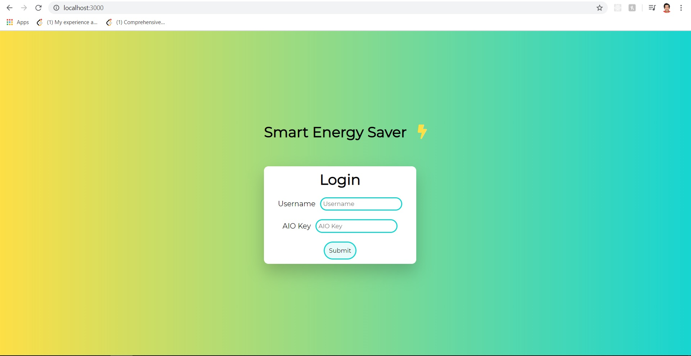
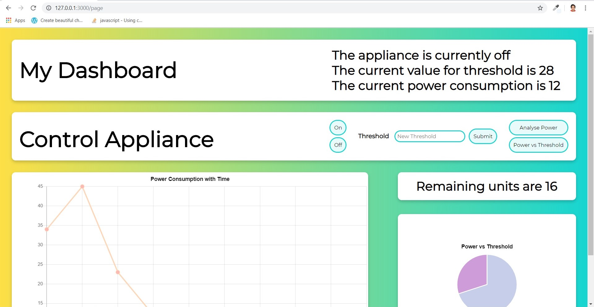
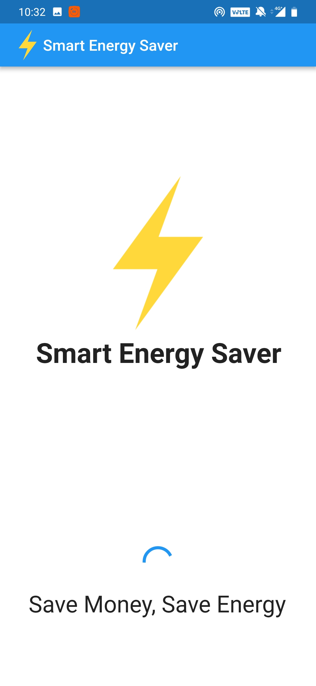
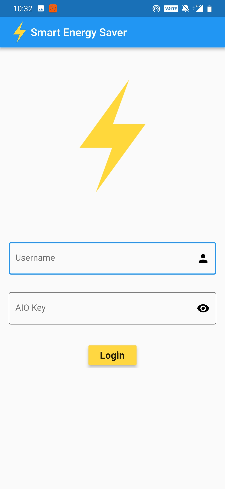
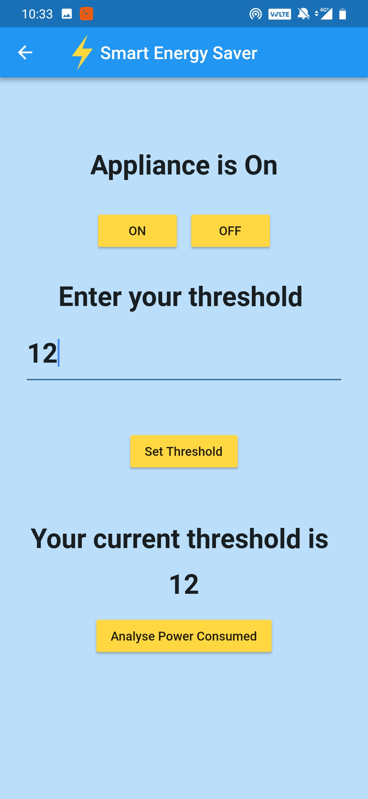

# Energy-Saver

## Description

A **publish/subscribe** based system using the MQTT protocol consisting of a **Flutter application, Browser application built using NodeJS** to cut off the circuit whenever the threshold power consumption is reached. The user can also switch the circuit on and off via both the apps and it offers complete synchronization between the mobile and browser app. The user can also track consumption using graphs in the browser app which have been implemented using **ChartJS**. The hardware has been implemented using NodeMCU, a current sensor and relays to calculate the power consumed in the circuit.

### Hardware 

### NodeJS

### Flutter 

